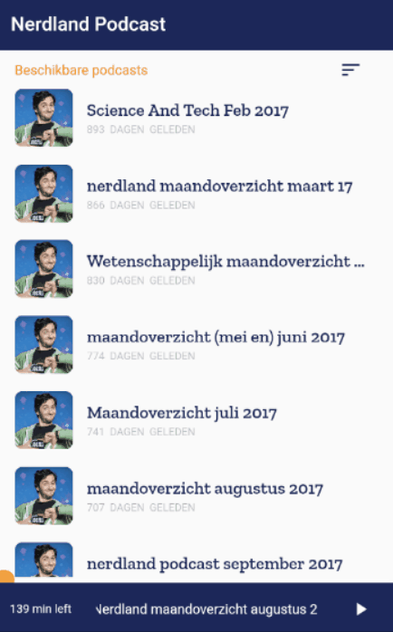

# Nerdland Podcast App

Nerdland Podcast application to listen to the [Nerdland Podcasts](https://podcasts.apple.com/be/podcast/nerdland-maandoverzicht-wetenschap-en-technologie/id1217629669). The app is mainly created to get used to more advanced state management in `Flutter`. The project makes use of the `Provider` package.

## Showcase
 

## Project
This project is mainly focused for Flutter developers who would like get used to more advanced state management.
So in short this project contains following use cases:
* Use of the `Provider` package
* USe of the `Bloc` pattern concept
* Simple widget tests
* Use of assets
* Use of external fonts
* Logo generations by `flutter_launcher_icons` package
* Flutter version: `1.5.4`

Design inspired by [Wendy Vargas](https://dribbble.com/shots/6103211--Nomadic-Podcast-app)

### Tests

This Flutter app contains some simple widget tests to demonstrate the way you should handle widget tests in your Flutter app. These tests should be run every time you commit a change, if needed update the tests.
This will ensure the quality of your application.

## Getting Started

Clone this repo and look into the source code
```
git clone https://github.com/devrnt/nerdland-podcast.git
```

### Application
```
flutter run 
```

### Tests

```
flutter test
```

## Packages
* [Provider](https://pub.dev/packages/provider)
* [rx_dart](https://pub.dartlang.org/packages/rxdart)
* [flutter_sound](https://pub.dartlang.org/packages/flutter_sounds)
